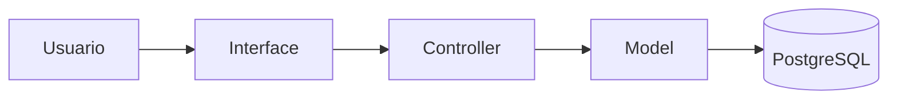
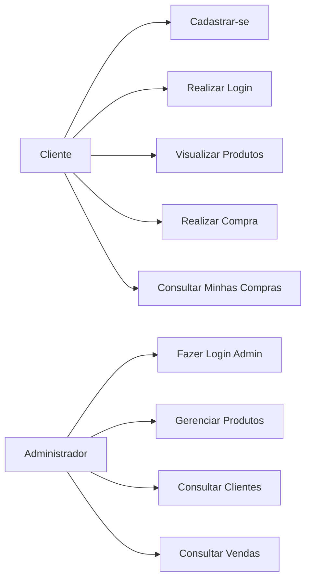
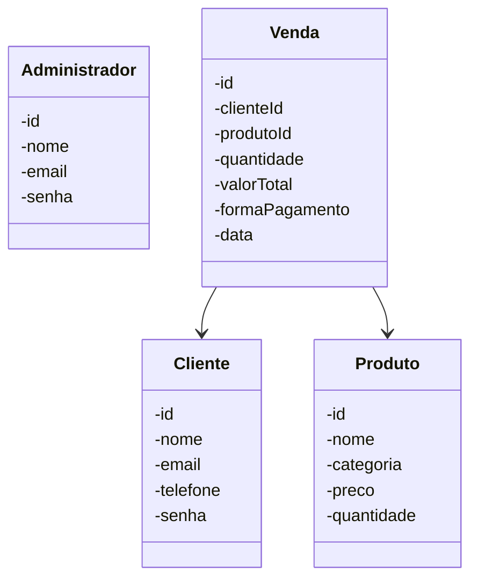
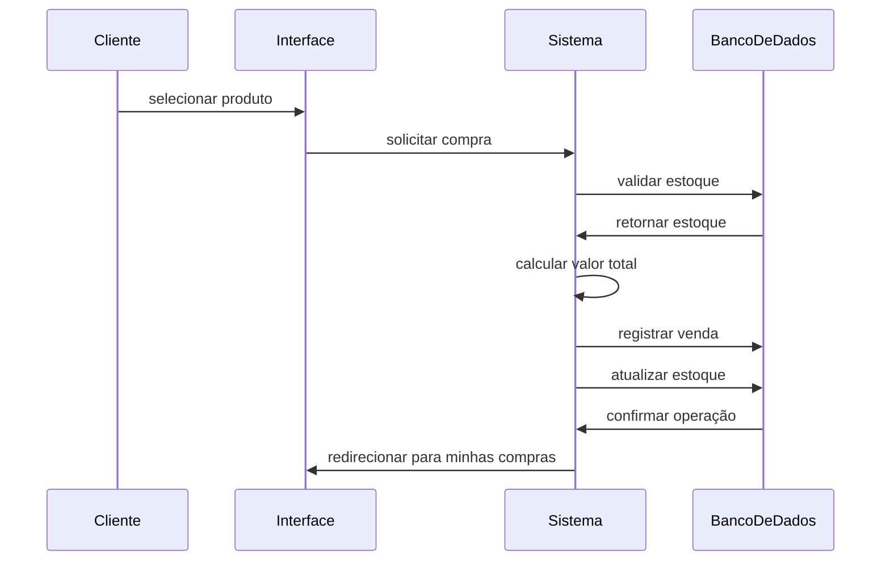
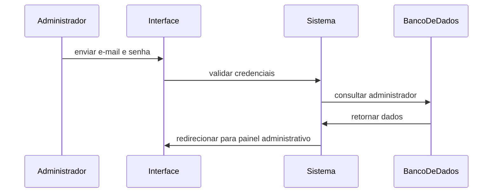
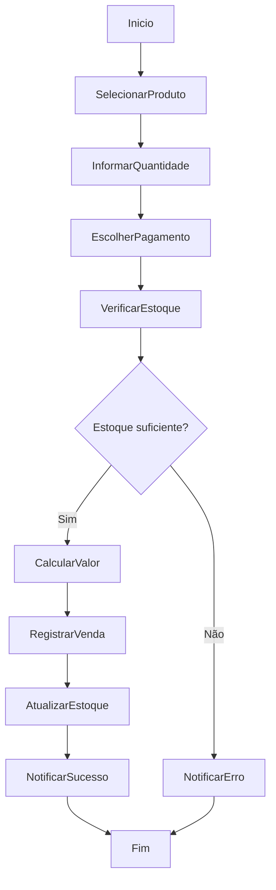
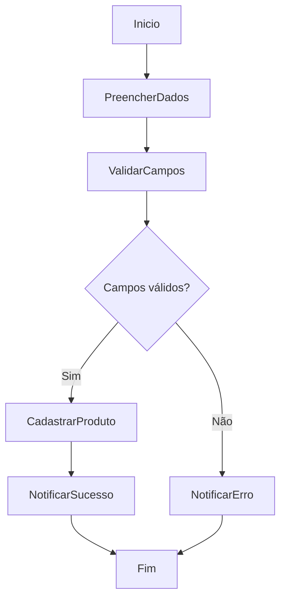

## Sistema de Controle de Loja de Bicicletas (GaluBikeShop)

**Padrão:** ISO/IEC/IEEE 29148:2018  
**Versão:** 1.0.0  
**Data:** 2026-04-14  
**Autor:** Gabriel Gomes de Queiroz

---

## Como Executar o Projeto
 
### Clonar o repositório
 
```bash
git clone https://github.com/GabrielQueiroz31/GaluBikeShop_PHP.git
```
 
### Entrar na pasta do projeto
 
```bash
cd GaluBikeShop_PHP
```
 
### Configurar o banco de dados
 
Acesse o PostgreSQL e crie o banco de dados:
 
```sql
CREATE DATABASE galubikeshop;
```
 
Em seguida, importe o arquivo `galubikeshop_dump.sql`:
 
```bash
psql -U postgres -d galubikeshop -f banco.sql
```
 
### Configurar a conexão
 
Abra o arquivo `conexao.php` e ajuste as credenciais conforme as suas:
 
```php
$host = "localhost";
$dbname = "galubikeshop";
$user = "postgres";
$password = "sua_senha";
```

### Credenciais de Acesso

```bash
**Login Administrador:**
- E-mail: `gomes@gmail.com`
- Senha: `321`
```

### Iniciar o servidor PHP
 
```bash
php -S localhost:8000
```

### Acessar no navegador
 
```
http://localhost:8000
```

---

## 1. Introdução

### 1.1 Propósito

Este documento descreve os requisitos do sistema **GaluBikeShop**, com objetivo de:

- definir funcionalidades;
- padronizar entendimento entre stakeholders;
- servir como base para desenvolvimento e testes.

---

### 1.2 Escopo

O sistema permitirá:

- cadastro e autenticação de clientes;
- autenticação de administradores;
- cadastro, listagem, edição e exclusão de produtos;
- visualização de clientes cadastrados pelo administrador;
- visualização de produtos disponíveis pelo cliente;
- realização de compras por clientes;
- registro de vendas com atualização automática de estoque;
- registro da forma de pagamento;
- visualização do histórico de compras do cliente;
- visualização de vendas realizadas pelo administrador;
- acesso a painel administrativo restrito.

O sistema será uma aplicação web utilizando:

- HTML;
- CSS;
- PHP;
- PostgreSQL.

---

### 1.3 Definições

| Termo | Definição |
| --- | --- |
| Produto | Item comercializado na loja de bicicletas |
| Venda | Registro de saída de produto associado a um cliente |
| Compra | Ação realizada pelo cliente ao adquirir um produto |
| Estoque | Quantidade disponível de produtos |
| Cliente | Usuário que realiza compras no sistema |
| Administrador | Usuário com acesso ao painel administrativo |
| Forma de pagamento | Método utilizado pelo cliente para realizar a compra |

**Acrônimos:**

- **SGQ** — Sistema de Gestão da GaluBikeShop
- **RF** — Requisito Funcional
- **RNF** — Requisito Não Funcional

---

### 1.4 Visão Geral do Documento

Este documento está organizado em:

- introdução e visão geral;
- descrição do sistema;
- requisitos detalhados;
- modelos UML;
- regras de negócio;
- banco de dados;
- protótipo;
- organização do projeto.

---

## 2. Descrição Geral do Sistema

### 2.1 Perspectiva do Sistema

O sistema é uma aplicação web com back-end em PHP e banco de dados PostgreSQL, operada em navegador.



---

### 2.2 Funções do Sistema

O sistema deve:

- cadastrar e autenticar clientes;
- autenticar administradores;
- cadastrar, listar, editar e excluir produtos;
- permitir que clientes visualizem produtos;
- permitir que clientes realizem compras;
- registrar vendas vinculadas a clientes e produtos;
- registrar a forma de pagamento da venda;
- atualizar o estoque após cada venda;
- permitir que clientes visualizem suas próprias compras;
- permitir que administradores visualizem clientes cadastrados;
- permitir que administradores visualizem vendas realizadas;
- restringir o acesso ao painel administrativo.

---

### 2.3 Classes de Usuários

| Usuário | Descrição |
| --- | --- |
| Cliente | Pode se cadastrar, fazer login, visualizar produtos, realizar compras e ver suas próprias compras |
| Administrador | Pode fazer login, acessar o painel administrativo, gerenciar produtos, visualizar clientes e visualizar vendas |

---

### 2.4 Ambiente Operacional

- Navegador web;
- Servidor com suporte a PHP;
- Banco de dados PostgreSQL.

---

### 2.5 Restrições

- Clientes não têm acesso ao painel administrativo;
- Administradores são cadastrados diretamente no banco de dados;
- Sessões PHP controlam o acesso às áreas protegidas;
- Apenas administradores podem gerenciar produtos;
- Administradores apenas visualizam os clientes cadastrados, sem editar ou excluir seus dados.

---

### 2.6 Suposições

- O usuário possui conhecimentos básicos de informática;
- O volume de dados é pequeno a médio;
- O sistema será utilizado em ambiente local ou escolar.

---

## 3. Requisitos do Sistema

### 3.1 Requisitos Funcionais

#### RF-001: Cadastro de Cliente

**Descrição:** Permitir que um novo cliente se cadastre no sistema.

- **Prioridade:** Alta
- **Versão:** 1.0
- **Data:** 2026-04-14
- **Rastreabilidade:** Necessidade do Stakeholder 001

**Critérios de Aceitação:**

- [ ] Entrada de dados: Nome, E-mail, Telefone e Senha
- [ ] Validação de campos obrigatórios
- [ ] Verificação de duplicidade de e-mail
- [ ] Senha armazenada de forma criptografada
- [ ] Saída: notificação de sucesso ou erro ao usuário

---

#### RF-002: Login de Cliente

**Descrição:** Permitir que clientes cadastrados façam login no sistema.

- **Prioridade:** Alta
- **Versão:** 1.0
- **Data:** 2026-04-14
- **Rastreabilidade:** Necessidade do Stakeholder 002

**Critérios de Aceitação:**

- [ ] Entrada de dados: E-mail e Senha
- [ ] Validação de credenciais
- [ ] Criação de sessão ao autenticar
- [ ] Saída: redirecionamento para a área do cliente ou mensagem de erro

---

#### RF-003: Login de Administrador

**Descrição:** Permitir que administradores façam login e acessem o painel administrativo.

- **Prioridade:** Alta
- **Versão:** 1.0
- **Data:** 2026-04-14
- **Rastreabilidade:** Necessidade do Stakeholder 003

**Critérios de Aceitação:**

- [ ] Entrada de dados: E-mail e Senha
- [ ] Validação de credenciais de administrador
- [ ] Criação de sessão ao autenticar
- [ ] Acesso restrito ao painel administrativo
- [ ] Saída: redirecionamento para o painel administrativo ou mensagem de erro

---

#### RF-004: Cadastro de Produto

**Descrição:** Permitir que administradores cadastrem novos produtos.

- **Prioridade:** Alta
- **Versão:** 1.0
- **Data:** 2026-04-14
- **Rastreabilidade:** Necessidade do Stakeholder 004

**Critérios de Aceitação:**

- [ ] Entrada de dados: Nome, Categoria, Preço e Quantidade
- [ ] Validação de campos obrigatórios
- [ ] Verificação de preço maior que zero
- [ ] Verificação de quantidade não negativa
- [ ] Saída: notificação ao usuário

---

#### RF-005: Listagem de Produtos

**Descrição:** Exibir os produtos cadastrados no sistema.

- **Prioridade:** Alta
- **Versão:** 1.0
- **Data:** 2026-04-14
- **Rastreabilidade:** Necessidade do Stakeholder 005

**Critérios de Aceitação:**

- [ ] Listagem de todos os produtos
- [ ] Saída: Id, Nome, Imagem, Categoria, Preço e Quantidade
- [ ] Exibição de botão de compra para produtos com estoque disponível
- [ ] Exibição de produto indisponível quando não houver estoque

---

#### RF-006: Edição de Produto

**Descrição:** Permitir que administradores editem os dados de produtos existentes.

- **Prioridade:** Alta
- **Versão:** 1.0
- **Data:** 2026-04-14
- **Rastreabilidade:** Necessidade do Stakeholder 006

**Critérios de Aceitação:**

- [ ] Verificar se o produto está cadastrado
- [ ] Entrada de dados: Nome, Categoria, Preço e Quantidade
- [ ] Validação de campos obrigatórios
- [ ] Validação de preço maior que zero
- [ ] Validação de quantidade não negativa
- [ ] Saída: notificação ao usuário

---

#### RF-007: Exclusão de Produto

**Descrição:** Permitir que administradores excluam produtos do sistema.

- **Prioridade:** Alta
- **Versão:** 1.0
- **Data:** 2026-04-14
- **Rastreabilidade:** Necessidade do Stakeholder 007

**Critérios de Aceitação:**

- [ ] Verificar se o produto existe
- [ ] Exclusão restrita a administradores
- [ ] Saída: notificação de sucesso ou erro

---

#### RF-008: Registro de Venda

**Descrição:** Permitir o registro de vendas vinculadas a clientes e produtos.

- **Prioridade:** Alta
- **Versão:** 1.0
- **Data:** 2026-04-14
- **Rastreabilidade:** Necessidade do Stakeholder 008

**Critérios de Aceitação:**

- [ ] Venda associada a cliente e produto cadastrados
- [ ] Verificação de quantidade em estoque
- [ ] Seleção da forma de pagamento
- [ ] Cálculo automático do valor total
- [ ] Atualização do estoque após a venda
- [ ] Saída: notificação de venda realizada ou redirecionamento para o histórico de compras

---

#### RF-009: Listagem de Vendas

**Descrição:** Exibir o histórico de vendas realizadas para o administrador.

- **Prioridade:** Média
- **Versão:** 1.0
- **Data:** 2026-04-14
- **Rastreabilidade:** Necessidade do Stakeholder 009

**Critérios de Aceitação:**

- [ ] Listagem de todas as vendas registradas
- [ ] Acesso restrito a administradores
- [ ] Saída: Id da venda, cliente, produto, quantidade, valor total, forma de pagamento e data

---

#### RF-010: Listagem de Clientes

**Descrição:** Permitir que administradores visualizem os clientes cadastrados.

- **Prioridade:** Média
- **Versão:** 1.0
- **Data:** 2026-04-14
- **Rastreabilidade:** Necessidade do Stakeholder 010

**Critérios de Aceitação:**

- [ ] Acesso restrito a administradores
- [ ] Saída: Id, Nome, E-mail e Telefone
- [ ] O administrador não deve editar ou excluir dados dos clientes

---

#### RF-011: Minhas Compras

**Descrição:** Permitir que clientes visualizem o histórico de suas próprias compras.

- **Prioridade:** Média
- **Versão:** 1.0
- **Data:** 2026-04-14
- **Rastreabilidade:** Necessidade do Stakeholder 011

**Critérios de Aceitação:**

- [ ] Acesso restrito a clientes logados
- [ ] Listagem apenas das compras do cliente autenticado
- [ ] Saída: Produto, Quantidade, Valor Total, Forma de Pagamento e Data da compra

---

### 3.2 Requisitos Não Funcionais

#### RNF-001: Usabilidade

**Descrição:** Interface organizada, profissional e intuitiva para clientes e administradores.

---

#### RNF-002: Desempenho

**Descrição:** O sistema deve apresentar respostas rápidas em operações simples, considerando o uso local e baixo volume de dados.

---

#### RNF-003: Tecnologia de Back-end

**Descrição:** Desenvolvimento do back-end utilizando PHP.

---

#### RNF-004: Banco de Dados

**Descrição:** Utilização de PostgreSQL como sistema de gerenciamento de banco de dados.

---

#### RNF-005: Consistência Visual

**Descrição:** CSS padrão aplicado a todas as páginas do sistema.

---

#### RNF-006: Controle de Acesso

**Descrição:** Utilização de sessões PHP para controlar o acesso às áreas protegidas.

---

#### RNF-007: Confiabilidade

**Descrição:** Validação de entrada de dados obrigatória em todas as operações críticas.

---

#### RNF-008: Organização

**Descrição:** O sistema deve possuir arquivos separados para área do cliente, área do administrador, conexão com banco de dados e estilos.

---

## 4. Regras de Negócio

| Regra de Negócio | Descrição |
| --- | --- |
| RN-001 | Um cliente deve possuir nome, e-mail, telefone e senha |
| RN-002 | Um administrador deve possuir nome, e-mail e senha |
| RN-003 | Apenas administradores podem cadastrar, editar e excluir produtos |
| RN-004 | Apenas administradores podem visualizar todos os clientes cadastrados |
| RN-005 | Administradores não devem editar ou excluir dados pessoais dos clientes |
| RN-006 | Um produto deve possuir nome, quantidade, categoria e preço |
| RN-007 | Preço e quantidade de produtos não podem ser negativos |
| RN-008 | Uma venda deve estar relacionada a um cliente e a um produto cadastrados |
| RN-009 | Não pode ser registrada uma venda sem informar cliente, produto e quantidade |
| RN-010 | Não pode ser realizada uma venda se a quantidade solicitada for maior que o estoque disponível |
| RN-011 | Após uma venda, a quantidade do produto deve ser atualizada no estoque |
| RN-012 | O sistema deve calcular o valor total da venda automaticamente |
| RN-013 | Toda venda deve possuir uma forma de pagamento |
| RN-014 | O cliente só pode visualizar o próprio histórico de compras |
| RN-015 | O sistema deve exibir mensagens de erro ou sucesso em todas as operações |

---

## 5. Modelos do Sistema

### 5.1 Diagrama de Casos de Uso



---

### 5.2 Diagrama de Classes UML



---

### 5.3 Diagrama de Sequência

#### 5.3.1 Registro de Venda



#### 5.3.2 Login de Administrador



---

### 5.4 Diagrama de Atividades

#### 5.4.1 Registro de Venda



#### 5.4.2 Cadastro de Produto



---

## 6. Banco de Dados

### 6.1 Tabelas do Sistema

| Tabela | Descrição |
| --- | --- |
| clientes | Armazena dados dos clientes cadastrados |
| administradores | Armazena dados dos administradores |
| produtos | Armazena dados dos produtos da loja |
| vendas | Armazena os registros de vendas realizadas |

---

### 6.2 Campos Principais

#### clientes

| Campo | Descrição |
| --- | --- |
| id | Identificador do cliente |
| nome | Nome do cliente |
| email | E-mail do cliente |
| telefone | Telefone do cliente |
| senha | Senha criptografada do cliente |

#### administradores

| Campo | Descrição |
| --- | --- |
| id | Identificador do administrador |
| nome | Nome do administrador |
| email | E-mail do administrador |
| senha | Senha do administrador |

#### produtos

| Campo | Descrição |
| --- | --- |
| id | Identificador do produto |
| nome | Nome do produto |
| categoria | Categoria do produto |
| preco | Preço do produto |
| quantidade | Quantidade disponível em estoque |

#### vendas

| Campo | Descrição |
| --- | --- |
| id | Identificador da venda |
| cliente_id | Cliente relacionado à venda |
| produto_id | Produto relacionado à venda |
| quantidade | Quantidade comprada |
| valor_total | Valor total calculado |
| forma_pagamento | Forma de pagamento escolhida |
| data_venda | Data em que a venda foi registrada |

---

## 7. Protótipo

O protótipo de baixa fidelidade das telas do sistema foi desenvolvido no Figma.

[Ver protótipo no Figma](https://www.figma.com/design/ioIFVbsbrJZPoFXoC3igVs/GaluBikeShop?node-id=0-1&t=lhzwdEJSx4djstjj-1)

---

## 8. Como Executar o Projeto
 
### 8.1  Clonar o repositório
 
```bash
git clone https://github.com/GabrielQueiroz31/GaluBikeShop_PHP.git
```
 
### 8.2 Entrar na pasta do projeto
 
```bash
cd GaluBikeShop_PHP
```
 
### 8.3 Configurar o banco de dados
 
Acesse o PostgreSQL e crie o banco de dados:
 
```sql
CREATE DATABASE galubikeshop;
```
 
Em seguida, importe o arquivo `galubikeshop_dump.sql`:
 
```bash
psql -U postgres -d galubikeshop -f banco.sql
```
 
### 8.4 Configurar a conexão
 
Abra o arquivo `conexao.php` e ajuste as credenciais conforme as suas:
 
```php
$host = "localhost";
$dbname = "galubikeshop";
$user = "postgres";
$password = "sua_senha";
```
 
### 8.5 Iniciar o servidor PHP
 
```bash
php -S localhost:8000
```

### 8.6 Acessar no navegador
 
```
http://localhost:8000
```

---

## 9. Estrutura do Projeto

```text
GaluBikeShop_PHP/
│
├── admin/                                  # Área administrativa
│   ├── cadastrar_produto.php               # Cadastro de novos produtos
│   ├── confirmar_excluir_produto.php       # Confirma a exclusão de produtos
│   ├── editar_produto.php                  # Edição de produtos cadastrados
│   ├── excluir_produto.php                 # Tela de exclusão de produtos
│   ├── listar_cliente.php                  # Listagem de clientes cadastrados
│   ├── listar_produto.php                  # Listagem de produtos
│   ├── listar_vendas.php                   # Histórico de vendas realizadas
│   ├── login_admin.php                     # Login do administrador
│   ├── logout_admin.php                    # Encerramento da sessão do administrador
│   └── painel_admin.php                    # Painel principal do administrador
│
├── cliente/                                # Área do cliente
│   ├── area_cliente.php                    # Página inicial do cliente
│   ├── cadastro_cliente.php                # Cadastro de novos clientes
│   ├── comprar_produto.php                 # Processo de compra de produtos
│   ├── login_cliente.php                   # Login do cliente
│   ├── logout_cliente.php                  # Encerramento da sessão do cliente
│   ├── minhas_compras.php                  # Histórico de compras do cliente
│   └── produtos_cliente.php                # Visualização dos produtos disponíveis
│
├── DB/
│   └── galubikeshop_dump.sql               # Script de criação e carga do banco PostgreSQL
│
├── img/                                    # Imagens utilizadas pelo sistema
│
├── conexao.php                             # Conexão com o banco de dados PostgreSQL
├── index.php                               # Página inicial de seleção de acesso
├── style.css                               # Estilização global do sistema
└── README.md                               # Documentação do projeto
```

## Autor

Gabriel Gomes de Queiroz